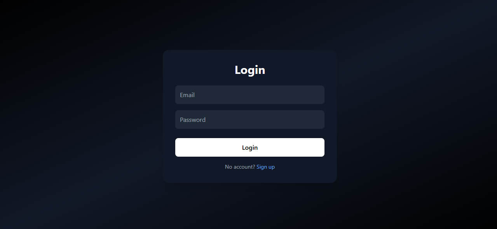
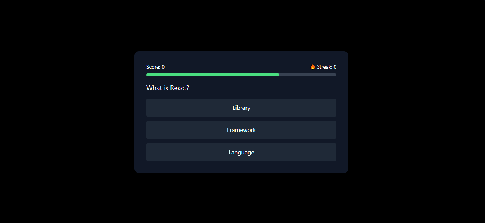
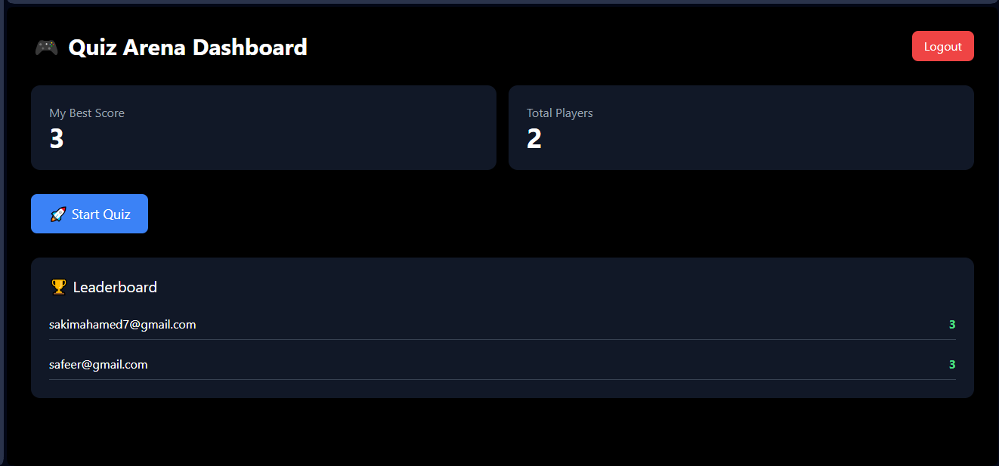

# 🚀 🎮 Quiz Arena

A high-performance, full-stack quiz platform designed to simulate real-world **interactive gaming and data-driven applications**.

Built with a focus on **scalable architecture, authentication systems, and engaging UI/UX**, this project demonstrates modern frontend and backend engineering practices.

🔗 **GitHub Repository:** https://github.com/ShakimAhamed/quiz-arena

<!-- 🌐 **Live Demo:** https://your-live-link.com -->

---

## 🌟 Overview

Quiz Arena is a gamified application where users can:

- 🔐 Register and authenticate securely
- 🎮 Play interactive quiz sessions
- ⏱ Compete with time-based challenges
- 📊 Track scores and streak performance
- ⚡ Experience smooth, responsive gameplay

---

## 🚀 Key Features

### 🔐 Authentication System

- Secure user signup & login
- Password hashing using **bcrypt**
- JWT-based authentication
- Protected API routes

---

### 🎮 Interactive Quiz Engine

- Dynamic question rendering
- Timer-based gameplay system
- Score and streak tracking
- Game phases:
    - Start → Play → Result

---

### ⚡ Performance Optimization

- Efficient state management using React hooks
- Optimized re-renders and UI updates
- Lightweight and fast Vite setup

---

### 📊 Data Management

- Persistent user data with MongoDB
- Structured schema design using Mongoose
- API-driven architecture for scalability

---

### 🎨 Modern UI/UX

- Responsive design (mobile + desktop)
- Clean layout using **Tailwind CSS**
- Smooth animations with **Framer Motion**
- Game-like experience with intuitive interactions

---

## 🧠 Engineering Highlights

- Designed a **full-stack authentication system (JWT)**
- Built a **state-driven quiz engine with multiple phases**
- Implemented **real-time scoring logic and streak tracking**
- Created a **modular and scalable frontend architecture**
- Integrated **REST APIs with a clean separation of concerns**
- Focused on **performance, UX, and maintainability**

---

## 💡 Motivation

This project was built to simulate real-world systems such as:

- Interactive learning platforms
- Gamified user engagement systems
- Data-driven frontend applications

The goal was to combine:

- ⚡ Performance
- 🧠 Scalable architecture
- 🎨 High-quality UI/UX

---

## 🛠️ Tech Stack

### Frontend

- React (TypeScript)
- Vite
- Tailwind CSS
- Framer Motion

### Backend

- Node.js
- Express.js
- MongoDB (Mongoose)

### Authentication

- JWT (JSON Web Tokens)
- bcrypt

---

## 📸 Preview

| Login                               | Quiz                              | Dashboard                                   |
| ----------------------------------- | --------------------------------- | ------------------------------------------- |
|  |  |  |

---

## 🏗️ Project Structure

```bash
Quiz-Arena/
│
├── client/ # Frontend (React)
│ ├── src/
│ │ ├── components/
│ │ ├── pages/
│ │ ├── hooks/
│ │ └── ...
│
├── server/ # Backend (Node.js)
│ ├── models/
│ ├── routes/
│ ├── controllers/
│ ├── middleware/
│ └── server.js
│
└── README.md
```

---

## 🚀 Getting Started

### 1️⃣ Clone the repository

```bash
git clone https://github.com/your-username/quiz-arena.git
cd quiz-arena
```

### 2️⃣ Install dependencies

📦 Backend

```bash
cd server
npm install
```

📦 Frontend

```bash
cd client
npm install
```

### 3️⃣ Setup Environment Variables

### Create .env file in /server:

```bash
MONGO_URI=your_mongodb_connection_string
JWT_SECRET=your_secret_key
PORT=5000
```

### 4️⃣ Run the app

From root:

```bash
npm run dev
```

## 👨‍💻 Author

**Shakim Ahamed**

Software Engineer

GitHub: https://github.com/ShakimAhamed

---

## ⭐ Support

If you like this project, give it a ⭐ on GitHub!
